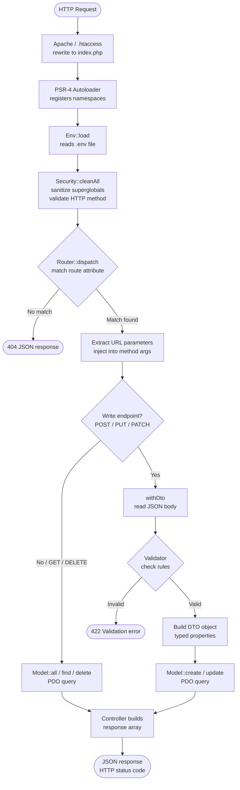

# SopaipillaPHP

> A lightweight, zero-dependency PHP 8 micro-framework for building JSON APIs.

[](https://www.php.net/)
[](LICENSE)

---

## Features

- **Attribute-based routing** — `#[Get('/path')]`, `#[Post('/path')]`, …
- **DTO validation** — structured input validation with typed DTOs
- **PSR-4 autoloading** — no Composer required at runtime
- **ORM base model** — thin PDO wrapper with SQLite and MySQL support
- **Security by default** — XSS sanitization, HTTP method whitelist, secure session cookies, AES-256-GCM encryption
- **Environment config** — `.env` loader with no third-party dependencies
- **Zero dependencies** — pure PHP 8.1+, `ext-pdo`, `ext-mbstring`

---

## Requirements

| Requirement | Version |
|---|---|
| PHP | 8.1 or higher |
| Extensions | `pdo`, `pdo_sqlite` or `pdo_mysql`, `mbstring`, `openssl` |
| Web server | Apache (`.htaccess` included) or PHP built-in server |

---

## Quick Start

```bash
# Clone the repository
git clone https://github.com/madkoding/sopaipilla-php.git
cd sopaipilla-php

# Copy and configure environment
cp .env.example .env

# Start the built-in server
php -S localhost:8000 index.php
```

Visit `http://localhost:8000/api/health` to confirm the app is running.

---

## Project Structure

```
.
├── index.php                   # Entry point — autoloader, env, security, router
├── .env                        # Local environment variables (not committed)
├── .env.example                # Environment template
├── .htaccess                   # Apache rewrite rules
│
├── App/                        # Application code (your domain)
│   ├── AppController.php       # Root and health endpoints
│   ├── database.php            # Database config (reads from .env)
│   └── Users/                  # Example resource module
│       ├── UsersController.php
│       ├── UsersModel.php
│       └── DTO/
│           ├── CreateUserDTO.php
│           ├── UpdateUserDTO.php
│           └── ChangePasswordDTO.php
│
└── Sopaipilla/                 # Framework core (do not modify for app logic)
    ├── Env.php                 # .env loader
    ├── Http/
    │   └── ApiController.php   # Base controller — security headers, helpers
    ├── Database/
    │   └── Model.php           # PDO-based ORM base class
    ├── Routing/
    │   ├── Router.php          # Attribute-based HTTP router
    │   └── Attributes/         # Get, Post, Put, Patch, Delete
    ├── Security/
    │   ├── Security.php        # Input sanitization, HTTP hardening
    │   ├── Crypt.php           # AES-256-GCM encryption + Argon2ID hashing
    │   └── Session.php         # Secure session management
    └── Validation/
        ├── Dto.php             # Abstract DTO base class
        ├── Validator.php       # Rule-based field validator
        └── ValidationException.php
```

---

## Request Lifecycle



---

## Environment Variables

Copy `.env.example` to `.env` and adjust to your environment:

```env
# Application
APP_ENV=development
APP_NAME="SopaipillaPHP App"
RANDOM_SEED=change-this-to-a-long-random-secret

# Database driver: sqlite | mysql
DB_CONNECTION=sqlite

# SQLite (used when DB_CONNECTION=sqlite)
DB_DATABASE=:memory:

# MySQL (used when DB_CONNECTION=mysql)
DB_HOST=127.0.0.1
DB_PORT=3306
DB_NAME=sopaipilla
DB_USERNAME=root
DB_PASSWORD=
DB_CHARSET=utf8mb4
```

> **Note:** `RANDOM_SEED` is required if you use `Crypt::encrypt()` / `Crypt::decrypt()`. A `RuntimeException` is thrown if it is undefined.

---

## Creating a Resource Module

### 1. Model

```php
// App/Posts/PostsModel.php
namespace App\Posts;

use Sopaipilla\Database\Model;

class PostsModel extends Model
{
    protected static string $table      = 'posts';
    protected static string $connection = 'sqlite';
    protected static array  $fillable   = ['title', 'body'];
    protected static array  $schema     = [
        'id    INTEGER PRIMARY KEY AUTOINCREMENT',
        'title TEXT    NOT NULL',
        'body  TEXT',
    ];
}
```

### 2. DTO

```php
// App/Posts/DTO/CreatePostDTO.php
namespace App\Posts\DTO;

use Sopaipilla\Validation\Dto;

final class CreatePostDTO extends Dto
{
    public string $title;
    public string $body;

    protected static function rules(): array
    {
        return [
            'title' => ['required' => true, 'min' => 3, 'max' => 200],
            'body'  => ['required' => true],
        ];
    }

    protected static function build(array $data): static
    {
        $dto = new static();
        $dto->title = trim($data['title']);
        $dto->body  = trim($data['body']);
        return $dto;
    }
}
```

### 3. Controller

```php
// App/Posts/PostsController.php
namespace App\Posts;

use Sopaipilla\Routing\Attributes\{Get, Post, Delete};
use Sopaipilla\Http\ApiController;
use App\Posts\DTO\CreatePostDTO;

class PostsController extends ApiController
{
    public function __construct()
    {
        parent::__construct();
        PostsModel::migrate();
    }

    #[Get('/api/posts')]
    public function index()
    {
        $data = PostsModel::all();
        return $this->json(['data' => $data, 'meta' => ['total' => count($data)]]);
    }

    #[Get('/api/posts/{id}')]
    public function show($id)
    {
        return $this->okOr404(PostsModel::find((int) $id), 'Post not found');
    }

    #[Post('/api/posts')]
    public function store()
    {
        return $this->withDto(CreatePostDTO::class,
            fn($dto) => $this->okOr201(PostsModel::create($dto->toArray()))
        );
    }

    #[Delete('/api/posts/{id}')]
    public function destroy($id)
    {
        return $this->okOr404(PostsModel::delete((int) $id), 'Post not found');
    }
}
```

### 4. Register the controller

```php
// index.php
use App\Posts\PostsController;

$router->registerController(new PostsController());
```

---

## ApiController Helpers

All controllers extending `ApiController` have access to:

| Method | Description |
|---|---|
| `$this->json($data, $status)` | JSON response with `success: true` |
| `$this->error($message, $status)` | JSON error response |
| `$this->okOr201($data)` | 201 Created or 500 on falsy |
| `$this->okOr404($data, $msg)` | 200 OK or 404 Not Found on falsy |
| `$this->withDto($class, $fn)` | Validate input via DTO, then execute callback |
| `$this->input()` | Read and sanitize JSON request body |

---

## Routing

Routes are defined via PHP 8 Attributes on controller methods:

```php
#[Get('/api/resource')]
#[Post('/api/resource')]
#[Put('/api/resource/{id}')]
#[Patch('/api/resource/{id}')]
#[Delete('/api/resource/{id}')]
```

URL parameters are injected as method arguments in order:

```php
#[Get('/api/users/{userId}/posts/{postId}')]
public function show($userId, $postId) { ... }
```

---

## Validation Rules

| Rule | Type | Description |
|---|---|---|
| `required` | `bool` | Field must be present and non-empty |
| `email` | `bool` | Must be a valid email address |
| `min` | `int` | Minimum string length |
| `max` | `int` | Maximum string length |
| `numeric` | `bool` | Must be numeric |
| `regex` | `string` | Must match the given pattern |
| `in` | `array` | Must be one of the allowed values |

---

## Security

| Layer | Implementation |
|---|---|
| Input sanitization | XSS patterns stripped from all superglobals on boot |
| HTTP method whitelist | `TRACE`, `CONNECT` and custom methods return 405 |
| Null byte detection | Requests with null bytes in query string or body are rejected |
| Session cookies | `httponly`, `samesite=Lax`, `secure` (when HTTPS) |
| HTTP security headers | `X-Content-Type-Options`, `X-Frame-Options`, `CSP`, `Referrer-Policy` |
| Encryption | AES-256-GCM (authenticated) — prevents padding oracle and bit-flipping |
| Password hashing | Argon2ID via `password_hash()` |
| Token generation | `random_bytes()` (CSPRNG) |

---

## Available Endpoints (example app)

| Method | Path | Description |
|---|---|---|
| `GET` | `/` | HTML index page |
| `GET` | `/api/health` | Application status |
| `GET` | `/api/users` | List all users |
| `GET` | `/api/users/{id}` | Get a user |
| `GET` | `/api/users/{id}/profile` | Get enriched user profile |
| `POST` | `/api/users` | Create a user |
| `PUT` | `/api/users/{id}` | Update a user |
| `PATCH` | `/api/users/{id}/password` | Change user password |
| `DELETE` | `/api/users/{id}` | Delete a user |

---

## License

MIT © [madKoding](https://github.com/madkoding)


---

## 🚀 Quick Start (3 minutes)

### 1. Install

```bash
git clone https://github.com/madkoding/sopaipilla-php my-project
cd my-project
```

### 2. Run

```bash
php -S localhost:8000 index.php
```

### 3. Open your browser

- **Web**: http://localhost:8000
- **API**: http://localhost:8000/api/health

---

## 📂 Project Structure

```
my-project/
├── App/              # Your application code
│   ├── database.php  # Database config (reads from .env)
│   └── Users/        # Example resource module
├── Sopaipilla/       # Framework core (do not modify for app logic)
├── index.php         # Single entry point
├── .htaccess         # Apache rewrite rules
└── .env              # Environment variables
```

---

## 🔌 Database Connections

### MySQL
```php
// App/database.php
'mysql' => [
    'driver'   => 'mysql',
    'host'     => 'localhost',
    'database' => 'my_db',
    'username' => 'root',
    'password' => '',
],
```

### PostgreSQL
```php
'pgsql' => ['driver' => 'pgsql', 'host' => 'localhost', 'database' => 'my_db']
```

### SQLite
```php
'sqlite' => ['driver' => 'sqlite', 'database' => ':memory:']
```

### SQL Server
```php
'sqlsrv' => ['driver' => 'sqlsrv', 'host' => 'localhost', 'database' => 'my_db']
```

---

## 🔌 Endpoint Matrix

| URL | GET | POST | PUT | DELETE |
|-----|-----|------|-----|--------|
| `/api/users` | List all | Create | - | - |
| `/api/users/{id}` | Get one | - | Update | Delete |

---

## 📝 Database Usage Example

```php
use Sopaipilla\Database\Model;

// All records
$users = UsersModel::all();

// Find by ID
$user = UsersModel::find(1);

// Create
$created = UsersModel::create(['name' => 'John', 'email' => 'john@test.com']);

// Update
$updated = UsersModel::update(1, ['name' => 'John']);

// Delete
UsersModel::delete(1);
```

---

## ✅ Why Sopaipilla?

- **Simple**: no configuration overhead, just add a controller
- **Zero dependencies**: pure PHP 8.1+ with PDO, no Composer required at runtime
- **Multi-DB**: MySQL, PostgreSQL, SQLite, SQL Server
- **Secure by default**: AES-256-GCM, Argon2ID, CSPRNG, XSS sanitization
- **Modern routing**: PHP 8 Attributes — no route files needed

---

**Get started now!**

```bash
git clone https://github.com/madkoding/sopaipilla-php my-project
cd my-project && php -S localhost:8000 index.php
```

<!-- AUTO-UPDATE-DATE -->
**Última actualización:** 2026-02-21 02:20:09 -03
